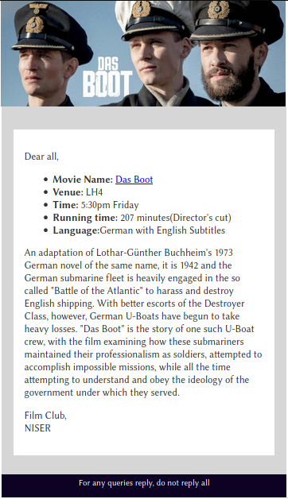

# Email Template

This template has been made for mobile devices specially as most people check email on their phones

## Example

### How to use:-
- Make a copy of this template/ Fork it.
- search for `~` in the this they are all the things to be updated I have left a little description as to what has to be put in
- when reviewing this file in browser it will show thicker borders that actually will in emails
- you can put in ` ` between text if required
- don't worry the comments won't show up in the email you can leave them as is
- When done updating content and stuff, just copy paste the whole code into gmail, it renders it directly!!(Even I was surprized!!)
